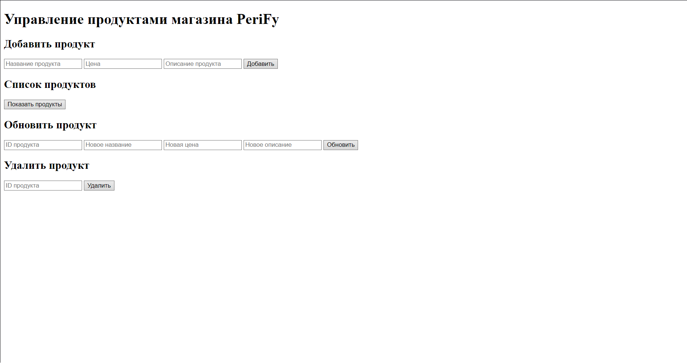

# PeriFy: Online Store for Computer Peripherals

## Project Description
PeriFy is an online store designed for selling computer peripherals, such as keyboards, mice, monitors, and headsets. 

### Purpose:
The purpose of PeriFy is to provide a simple and efficient platform for managing and selling computer accessories online.

### What It Does:
- Displays a catalog of products for customers.
- Allows the store owner to **add**, **view**, **update**, and **delete** products through a user-friendly interface.
- Handles product data securely using MongoDB.

### Who It Targets:
PeriFy is targeted at **gamers, tech enthusiasts, and professionals** who require reliable and high-performance computer peripherals. The store is also ideal for individuals building custom PC setups or upgrading their computer hardware.


## Team Members
- Iman Meraliev(SE-2319),Erasyl Edilzhan(SE-2314),Miras Kozhakhmetov(SE-2314)

## Screenshot of the Main Page


## How to Start the Project

### Prerequisites
- **Go (Golang)**
- **MongoDB**

### Steps to Start the Project
1. Clone the repository

2. Install dependencies:
   ```bash
   go get go.mongodb.org/mongo-driver/mongo
   ```

3. Start MongoDB locally (default port `27017`).

4. Run the server:
   ```bash
   go run main.go
   ```
   - The server will start at `http://localhost:8080`.

5. Open the HTML page in your browser:
   - Locate and open `index.html` to access the product management interface.

## Tools and Resources Used
- **Go (Golang)**: Backend development
- **MongoDB**: Database for storing product data
- **HTML & JavaScript**: Frontend interface
- **Postman**: For testing API endpoints

- Tools and Resources Used
Go (Golang): Backend development for building the API.
MongoDB: Database for secure and efficient storage of product data.
HTML & JavaScript: Frontend for user interaction and product management.
Postman: For testing and validating API endpoints during development.
